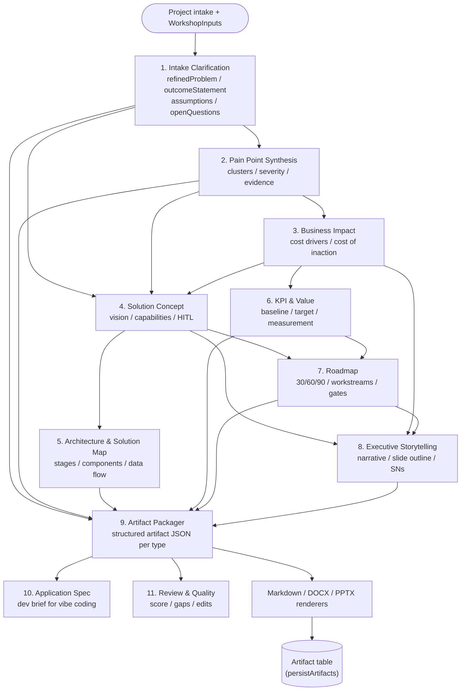
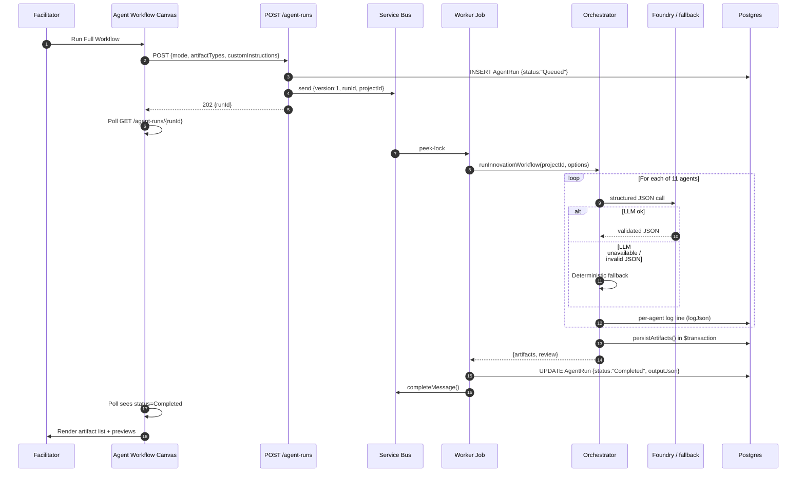

# Agents

Workshop Buddy ships **11 specialized agents** plus a side-path **Transcript Intake Agent**. Each agent is a persona-card system prompt + JSON output schema in [src/lib/agents/agent-prompts.ts](../src/lib/agents/agent-prompts.ts), executed sequentially by the orchestrator in [src/lib/agents/orchestrator.ts](../src/lib/agents/orchestrator.ts).

> Companion docs: [architecture.md](architecture.md) · [ui-flows.md](ui-flows.md) · [azure-architecture.md](azure-architecture.md) · [transcript-ingest.md](transcript-ingest.md)

---

## Why 11 agents?

Single-prompt artifact generation collapses under its own context: you can't ask one LLM call to cluster pain points, defend a business case, sketch an architecture, build a 90-day plan, and render an executive deck without one of those concerns drowning out the others. Workshop Buddy splits the work along **persona expertise lines** — each agent has a distinct expertise lens, a small handoff contract, and a typed JSON output. Downstream agents read upstream output under `upstream.<agentName>` keys so the chain stays explicit and debuggable.

Every agent has a deterministic JavaScript fallback so the workflow never breaks the demo — if the LLM is unavailable or returns invalid JSON, the fallback produces credible content grounded in the workshop inputs.

---

## The eleven agents

| # | Agent | Persona lens | Produces | Consumed by |
| --- | --- | --- | --- | --- |
| 1 | **Intake Clarification** | Workshop translator | Refined problem + outcome statement + assumptions + open questions | All downstream agents |
| 2 | **Pain Point Synthesis** | Theme clustering | Pain-point clusters with severity + evidence quotes | Business Impact, Solution Concept, Reviewer |
| 3 | **Business Impact** | CFO lens | Cost drivers, revenue leakage, productivity, CX, risk, cost-of-inaction | Solution Concept, KPI, Executive Storytelling |
| 4 | **Solution Concept** | Solution architect | Solution vision, core capabilities, tech components, HITL model | Architecture, Roadmap, Executive Storytelling |
| 5 | **Architecture & Solution Map** | Reference-architect | End-to-end stages, components, data flow, governance | Roadmap, Artifact Packager |
| 6 | **KPI & Value** | Value engineer | KPI framework, baseline + target metrics, measurement method | Roadmap, Executive Storytelling, Artifact Packager |
| 7 | **Roadmap** | Delivery lead | 30/60/90-day plan, workstreams, milestones, dependencies, decision gates | Executive Storytelling, Artifact Packager |
| 8 | **Executive Storytelling** | Board narrator | Executive summary, board-ready storyline, slide outline, speaker notes | Artifact Packager |
| 9 | **Artifact Packager** | Production editor | Structured artifact JSON per requested type (Impact Statement, Briefing Deck, Solution Map, 90-Day Plan, KPI Framework, Trends White Paper) | Application Spec, Review & Quality, renderers |
| 10 | **Application Spec** | VS Code + Copilot prompt engineer | Developer-ready spec brief for vibe coding | Reviewer |
| 11 | **Review & Quality** | QA reviewer | Quality score, missing sections, suggested edits, consistency warnings | UI surfacing |

The side-path **Transcript Intake Agent** ([src/lib/agents/transcript-intake.ts](../src/lib/agents/transcript-intake.ts)) is independent — it runs only when a facilitator uses the *Import from transcript* button on Workshop Studio, and it produces candidate `WorkshopInput` cards for human review. See [transcript-ingest.md](transcript-ingest.md).

---

## Handoff graph

Solid arrows = required upstream payload; an agent reads each parent's output from `upstream.<camelCaseName>` in its user-prompt context. The orchestrator validates these dependencies via the `dependsOn` field on each [AgentDefinition](../src/lib/agents/agent-prompts.ts).

---

## Run lifecycle

---

## Anti-patterns the persona cards enforce

Every agent's `systemPrompt` follows the same shape (see the persona-card template comment at the top of [agent-prompts.ts](../src/lib/agents/agent-prompts.ts)) and ends with an explicit anti-patterns list. The recurring ones:

- **Inventing client facts** — financial values, customer names, commitments not in the inputs.
- **Restating upstream** — each agent must transform, not echo.
- **Generic marketing language** — agents are prompted to flag this as a failure mode.
- **Refusing on sparse inputs** — every agent has an *escape hatch* directive: emit minimum valid JSON, flag gaps in `assumptions`, do not refuse.
- **Wrapping JSON in code fences** — the closing line of every system prompt is *"Emit ONLY the JSON object matching the schema. No preamble, no trailing prose, no markdown fences around the top-level object."*

---

## Adding a new agent

1. Add a new `AgentDefinition` to the appropriate export in [src/lib/agents/agent-prompts.ts](../src/lib/agents/agent-prompts.ts) — fill out all 9 sections of the persona-card template.
2. Add a `dependsOn` list of upstream agent display names; add yourself to the `produces` list of each parent.
3. Add a deterministic fallback in [orchestrator.ts](../src/lib/agents/orchestrator.ts) — never let the LLM be the only code path.
4. Add a schema for the new artifact (if any) in [src/lib/artifacts/artifact-schemas.ts](../src/lib/artifacts/artifact-schemas.ts) plus a renderer entry in the markdown/docx/pptx renderers.
5. Update the handoff graph above.

---

## See also

- [architecture.md](architecture.md) — code structure + run flow
- [transcript-ingest.md](transcript-ingest.md) — transcript intake side-path
- [src/lib/prompts/](../src/lib/prompts/) — shared system + packager + regenerate prompts
- [spec/InnovateImpact.md](spec/InnovateImpact.md) §8 — original agent spec
