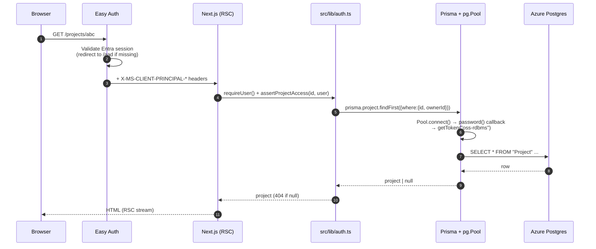
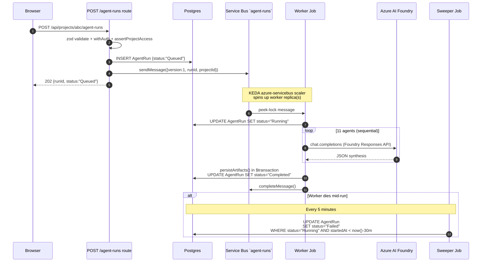
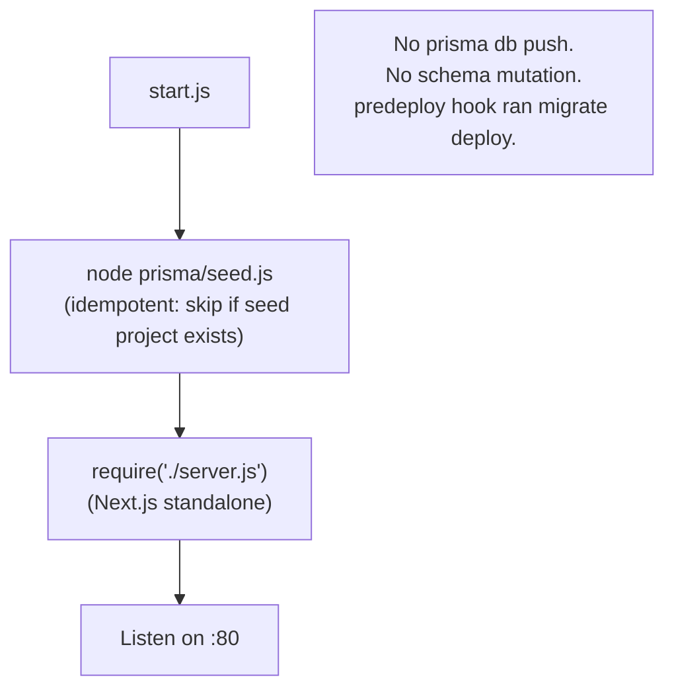

# Architecture

A deeper look at the Workshop Buddy codebase: how the Next.js app, Prisma, the 11-agent orchestrator, and the Service Bus queue fit together.

> Companion docs: [agents.md](agents.md) · [ui-flows.md](ui-flows.md) · [azure-architecture.md](azure-architecture.md) · [deployment.md](deployment.md) · [transcript-ingest.md](transcript-ingest.md)

---

## Stack snapshot

| Layer | Choice | Notes |
| --- | --- | --- |
| Web framework | Next.js 14.2 (App Router) | `output: "standalone"`, scope hoisting disabled (Node 23 / Next 14 webpack bug) |
| Language | TypeScript 5 (strict) | |
| UI | Tailwind CSS + shadcn-style primitives | Components in [src/components/](../src/components/) |
| ORM | Prisma 5.22 + `@prisma/adapter-pg` | Driver adapter so we can supply Entra access tokens per pool connection |
| Database | Azure Postgres Flexible Server 16 | Entra-only (`passwordAuth: Disabled`), TLS via Node's bundled CA roots |
| AI provider | Azure AI Foundry (default) / Azure OpenAI / OpenAI / mock | [src/lib/ai/provider.ts](../src/lib/ai/provider.ts) |
| Queue | Azure Service Bus (Basic) | Queue `agent-runs`, peek-lock, `maxDeliveryCount: 2`, DLQ on expiration |
| Background work | Azure Container Apps Jobs | Worker (Event/KEDA) + sweeper (Schedule cron) |
| Auth | ACA Easy Auth (single-tenant Entra) | App reg `wb-${envName}-easyauth`, header-based principal — no token store |
| Docs/PPTX | `docx` + `pptxgenjs` | Pure-Node renderers, no Office dependency |

---

## High-level component view

```mermaid
flowchart LR
  Browser["Facilitator browser"]

  subgraph ACA["Azure Container Apps environment"]
    direction TB
    EasyAuth["ACA Easy Auth<br/>(Entra single-tenant)"]
    Web["Next.js Container App<br/>(SSR + App Router + /api routes)"]
    Worker["Container Apps Job: worker<br/>(KEDA azure-servicebus, 0-5 replicas)"]
    Sweeper["Container Apps Job: sweeper<br/>(cron */5 * * * *)"]
  end

  SB[("Azure Service Bus<br/>queue: agent-runs")]
  PG[("Azure Postgres FS<br/>workshopbuddy DB")]
  Foundry["Azure AI Foundry<br/>(gpt-5.4)"]
  ACR[("Azure Container Registry")]

  Browser -->|HTTPS| EasyAuth --> Web
  Web -->|prisma + pg pool<br/>Entra token| PG
  Web -->|enqueue {runId, projectId}| SB
  Web -->|Foundry responses API<br/>UAMI token| Foundry
  SB -->|peek-lock| Worker
  Worker -->|update AgentRun + Artifact| PG
  Worker -->|Foundry responses API| Foundry
  Sweeper -->|UPDATE stuck Running runs| PG
  Web -.image pull (UAMI).-> ACR
  Worker -.image pull (UAMI).-> ACR
  Sweeper -.image pull (UAMI).-> ACR
```

Web, worker, and sweeper run the **same image** with different `command:` entrypoints — see [Dockerfile](../Dockerfile) and the job definitions in [infra/resources.bicep](../infra/resources.bicep).

---

## Code structure

```text
src/
├── app/                       # Next.js App Router pages + /api routes
│   ├── layout.tsx             # AppShell wrapper
│   ├── page.tsx               # Dashboard
│   ├── projects/              # /projects, /projects/[id], /projects/[id]/{workshop,agents,artifacts,edit}, /projects/new
│   ├── workshop/page.tsx      # Top-level Workshop Studio shortcut
│   ├── agents/page.tsx        # Top-level Agent Workflow shortcut
│   ├── artifacts/page.tsx     # Top-level Artifacts shortcut
│   ├── help/page.tsx          # Facilitator playbook
│   ├── settings/page.tsx      # Provider + demo settings
│   └── api/                   # REST routes (auth-wrapped; /api/health is public)
│       ├── health/route.ts
│       ├── projects/...       # CRUD + nested inputs/agent-runs/artifacts/transcripts
│       ├── inputs/[inputId]/...
│       └── artifacts/[artifactId]/{,download,regenerate}
├── components/
│   ├── app-shell.tsx          # Sidebar + topbar
│   ├── ui.tsx                 # shadcn-style primitives
│   ├── project-intake-wizard.tsx
│   ├── projects-list.tsx
│   ├── workshop-board.tsx
│   ├── transcript-import-modal.tsx
│   ├── agent-workflow-canvas.tsx
│   ├── artifact-workspace.tsx
│   └── delete-project-button.tsx
└── lib/
    ├── auth.ts                # Easy Auth header decode + assertProjectAccess / assertArtifactAccess / assertInputAccess + withAuth wrapper
    ├── db.ts                  # Prisma client + pg.Pool with async Entra-token password
    ├── env.ts                 # Lazy zod env proxy
    ├── utils.ts
    ├── workshop-enums.ts      # CATEGORIES / PERSONAS / PRIORITIES + type guards
    ├── ai/provider.ts         # Foundry / Azure OpenAI / OpenAI / mock abstraction
    ├── api/
    │   ├── parse-body.ts      # zod-based body parser
    │   ├── response.ts        # standard {ok|error, ...} envelopes
    │   └── schemas.ts         # All request/response zod schemas
    ├── agents/
    │   ├── agent-prompts.ts   # 11 persona-card system prompts + JSON schema hints
    │   ├── orchestrator.ts    # Sequential agent execution + fallbacks
    │   ├── envelope.ts        # {version:1, runId, projectId} Service Bus envelope schema
    │   ├── queue.ts           # ServiceBusClient producer (cached, DefaultAzureCredential)
    │   ├── persist-artifacts.ts  # Shared upsert helper (composite-key findUnique + $transaction)
    │   └── transcript-intake.ts  # Transcript -> WorkshopInput card extractor
    ├── transcripts/parse.ts   # docx/pdf/vtt/srt/txt/md transcript parser (10 MB cap)
    ├── prompts/               # system.md, artifact-packager.md, regenerate.md
    └── artifacts/
        ├── artifact-schemas.ts
        ├── markdown-renderer.ts
        ├── docx-renderer.ts
        └── pptx-renderer.ts

worker/
├── agent-run-worker.ts        # Service Bus consumer (peek-lock, 5 min lock, 30 s renewal)
└── sweeper.js                 # Marks AgentRun.status="Running" >30 min old as Failed
```

---

## Request flow — synchronous read (e.g. `GET /projects/[id]`)



---

## Request flow — agent run (asynchronous, queued)



Idempotency: the worker reads `AgentRun.status` and skips if already in a `TERMINAL_STATUSES` set (`Completed`, `Failed`, `Cancelled`). The same message can be re-delivered up to `maxDeliveryCount: 2`; on the 3rd attempt it dead-letters.

Local dev fallback: if `SERVICEBUS_NAMESPACE` is unset, the API route runs the orchestrator in-process and returns the completed run synchronously — so `npm run dev` keeps working without Azure.

---

## Auth model (Easy Auth + per-resource access)

```mermaid
flowchart LR
  Req["Incoming /api/* request"] --> EA["Easy Auth: validate Entra session"]
  EA -->|unauthenticated| Login["302 → /.auth/login/aad"]
  EA -->|authenticated| Headers["Inject X-MS-CLIENT-PRINCIPAL-*"]
  Headers --> withAuth["withAuth(handler) wrapper"]
  withAuth --> req["requireUser()<br/>returns {oid, upn, name}"]
  req --> route["Route handler"]
  route --> access{"assertProjectAccess<br/>assertArtifactAccess<br/>assertInputAccess"}
  access -->|404 on mismatch<br/>(no enumeration)| Done404["404"]
  access -->|owner match| Work["Run query / mutation"]
  Work --> Resp["200/201/202 + JSON"]
```

- `Project.ownerId` is set on create from the caller's Entra `oid`.
- All access helpers return **404, not 403**, to avoid enumeration.
- Local dev: set `DEV_AUTH_BYPASS_OID/UPN/NAME` in `.env` (only honored when `NODE_ENV !== 'production'`).
- Health probe (`/api/health`) is on the Easy Auth `excludedPaths` list so the platform liveness probe works.

---

## Persistence model

Schema lives in [prisma/schema.prisma](../prisma/schema.prisma). Key tables:

| Table | Purpose |
| --- | --- |
| `Project` | Owner-scoped workshop project. `ownerId` (Entra oid), intake fields, status. |
| `WorkshopInput` | Cards on the workshop board. Category, persona, priority, votes, optional `transcriptIngestId` for provenance. |
| `AgentRun` | One row per workflow run. `status`, `inputJson`, `outputJson`, `startedAt`, `completedAt`. |
| `Artifact` | One row per `(projectId, artifactType)` (composite unique). `contentJson` + rendered `markdown`. |
| `ArtifactVersion` | History snapshot per `Artifact`. |
| `TranscriptIngest` | Audit row per transcript upload (source, format, char length, cards proposed/accepted, LLM used). |

Schema changes flow through **versioned Prisma migrations** in [prisma/migrations/](../prisma/migrations/) — never `prisma db push` at container start. The azd `predeploy` hook runs `prisma migrate deploy` before a new image rolls out (see [deployment.md](deployment.md)).

---

## Container boot sequence

[start.js](../start.js) is the container `CMD`:



This is the resolution of backlog item **P0-3** — one bad schema diff used to wipe the demo DB on container restart. Now schema diffs **fail closed** with a clear Prisma runtime error if a migration was missed.

---

## Environment variables

Loaded lazily via a zod-validated proxy in [src/lib/env.ts](../src/lib/env.ts). Required at runtime depends on configuration:

| Variable | When required | Source |
| --- | --- | --- |
| `DATABASE_URL` | Always | Bicep-wired to PG FQDN, no password |
| `AZURE_CLIENT_ID` | ACA (UAMI) | UAMI client id from Bicep output |
| `AI_PROVIDER` | If using AI | `azure_foundry` \| `azure_openai` \| `openai` \| unset (demo mode) |
| `AZURE_FOUNDRY_RESPONSES_ENDPOINT` / `AZURE_FOUNDRY_MODEL` | Foundry provider | Bicep-wired |
| `SERVICEBUS_NAMESPACE` / `SERVICEBUS_QUEUE` | Production background runs | Bicep-wired (omit locally → in-process orchestrator) |
| `AAD_APP_CLIENT_ID` / `AAD_APP_CLIENT_SECRET` | Easy Auth | Created by `azd preprovision` hook |
| `DEV_AUTH_BYPASS_OID/UPN/NAME` | Local dev | Set in `.env`; ignored in production |

See [.env.example](../.env.example) for the full list.

---

## Error handling pattern

- API routes: `parseBody(req, schema)` returns `{ ok: false, response: NextResponse }` on validation failure → return immediately with `400` + zod issues envelope.
- Access helpers throw a typed `404 Not Found` `NextResponse` — handlers re-throw or return directly.
- Orchestrator: each agent has a deterministic fallback in [src/lib/agents/orchestrator.ts](../src/lib/agents/orchestrator.ts). If the LLM call fails or returns invalid JSON, the fallback fires, the run still completes, and the artifact still renders.
- Worker: throws → `abandonMessage` (re-deliver up to `maxDeliveryCount`); malformed envelope → `deadLetterMessage` immediately.

---

## See also

- [agents.md](agents.md) — what the 11 agents do and how they hand off
- [ui-flows.md](ui-flows.md) — navigation + screen flow
- [azure-architecture.md](azure-architecture.md) — full Azure topology + RBAC
- [deployment.md](deployment.md) — `azd up` walkthrough + Bicep + hooks
- [transcript-ingest.md](transcript-ingest.md) — Transcript Intake Agent design
- [spec/InnovateImpact.md](spec/InnovateImpact.md) — original product requirements spec
