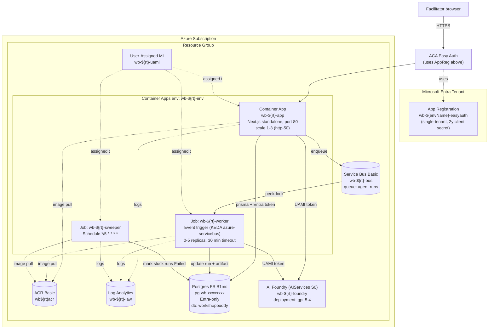
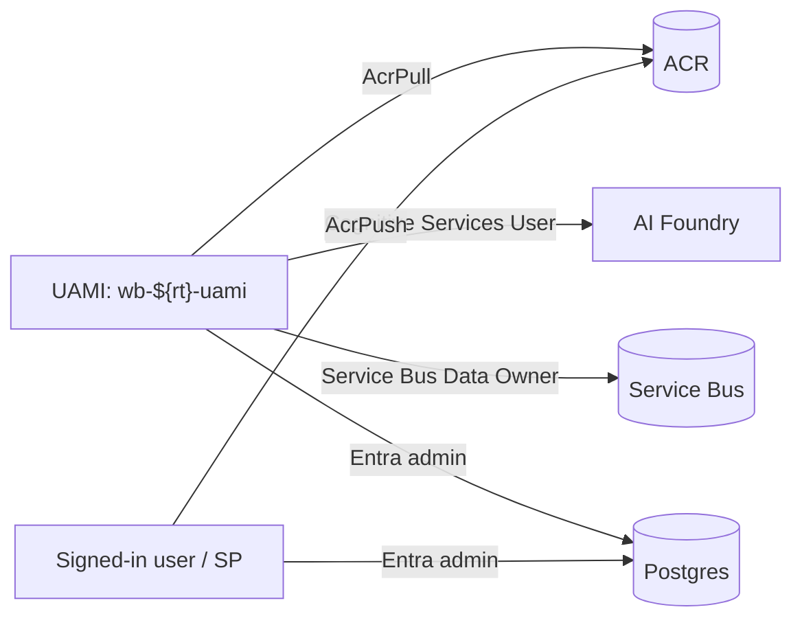

# Azure Architecture

Workshop Buddy deploys as a small Azure footprint built entirely from [infra/main.bicep](../infra/main.bicep) → [infra/resources.bicep](../infra/resources.bicep) and orchestrated by `azd up`. Everything below comes from one user-assigned managed identity (UAMI) — no passwords, no service principals, no shared secrets between services.

> Companion docs: [architecture.md](architecture.md) · [deployment.md](deployment.md)

---

## Resource inventory

All resources share an `rt` (resource token) suffix derived from `${subscriptionId}-${envName}-${location}` so two envs in one subscription never collide.

| Resource | Name pattern | SKU / config |
| --- | --- | --- |
| User-assigned managed identity | `wb-${rt}-uami` | Single identity used everywhere |
| Container Registry | `wb${rt}acr` | Basic, admin disabled, UAMI = AcrPull, principal = AcrPush |
| Log Analytics workspace | `wb-${rt}-law` | PerGB2018, 30-day retention |
| Container Apps environment | `wb-${rt}-env` | Workload profiles disabled, LAW-bound |
| Container App (web) | `wb-${rt}-app` | UAMI, ingress port 80, scale 1–3, http-50 |
| Container Apps Job (worker) | `wb-${rt}-worker` | Event trigger, KEDA `azure-servicebus` rule, 0–5 replicas, `replicaTimeout 1800` |
| Container Apps Job (sweeper) | `wb-${rt}-sweeper` | Schedule cron `*/5 * * * *`, single replica |
| Service Bus namespace + queue | `wb-${rt}-bus` / `agent-runs` | Basic SKU, `maxDeliveryCount: 2`, `lockDuration PT5M`, TTL `PT1H`, DLQ on expiration |
| Postgres Flexible Server | `pg-wb-<8char>` | Burstable B1ms, PG16, **Entra-only** (`passwordAuth: Disabled`), `AllowAzureServices` FW, DB `workshopbuddy` |
| AI Foundry account | `wb-${rt}-foundry` | Kind `AIServices`, S0; model deployment `gpt-5.4` (GlobalStandard) |
| Auth config | `authConfigs/current` on web | Easy Auth, `RedirectToLoginPage`, excludes `/api/health` + Next.js static |

The app reg `wb-${envName}-easyauth` (single-tenant) is created out-of-band by the `azd preprovision` hook (it's a tenant-scoped resource — see [deployment.md](deployment.md)).

---

## Topology



---

## Identity model

All compute identity flows from a **single UAMI** assigned to the three Container Apps resources (web app + 2 jobs). That UAMI is granted:

| Scope | Role | Why |
| --- | --- | --- |
| ACR | `AcrPull` | Image pulls without admin user |
| Foundry account | `Cognitive Services User` | Foundry Responses API access (no API key) |
| Service Bus namespace | `Azure Service Bus Data Owner` | Send (web) + receive/settle (worker) |
| Postgres server | Entra admin via `az postgres flexible-server microsoft-entra-admin create` | Token-auth login as `<uami-name>` |

The signed-in deployer principal is also granted:

| Scope | Role | Why |
| --- | --- | --- |
| ACR | `AcrPush` | So `azd deploy` (or `docker push`) works from the dev box |
| Postgres server | Entra admin | So `prisma migrate deploy` (predeploy hook) and ad-hoc diagnostics work |



The Easy Auth app registration is a tenant-level object and is **not** a managed identity — see [deployment.md](deployment.md) for why the preprovision hook handles it out-of-band.

---

## Network + data path

- **Ingress.** ACA platform ingress, public, HTTPS, FQDN like `wb-${rt}-app.<region>.azurecontainerapps.io`. Easy Auth fronts every request except `/api/health` + Next.js static asset paths.
- **Postgres reachability.** `AllowAzureServices` firewall rule + Entra-only auth — no public password surface, ACA egress is treated as an Azure-services source.
- **TLS to Postgres.** Standard PG SSL with `rejectUnauthorized: true`. We don't ship a custom CA file — Node's bundled DigiCert Global Root G2 covers Azure PG.
- **Service Bus.** Basic SKU is enough: peek-lock, sessions not needed, no topics. Lock duration 5 min, renewal every 30 s in [worker/agent-run-worker.ts](../worker/agent-run-worker.ts).
- **No KV.** Easy Auth client secret is the only meaningful secret and lives in ACA secret store as `aad-client-secret`. PG, Foundry, ACR, and Service Bus are all Entra-authed via UAMI.

---

## Scale + cost shape

| Component | Idle cost shape | Burst behavior |
| --- | --- | --- |
| Container App (web) | 1 replica min (always-on) | Scales to 3 on http-50 |
| Worker Job | 0 replicas idle | KEDA wakes replicas only when `agent-runs` queue depth > 0 |
| Sweeper Job | 0 between cron firings | Runs every 5 min, < 1 s of work |
| Postgres B1ms | Always-on Burstable | Vertical scale + read replicas if needed |
| Service Bus Basic | ~$/month per namespace | Pay per million operations |
| Foundry | Pay-per-token | No standing cost |

The 0-replica worker is the big design choice — most demo deployments sit idle and cost only the web app + B1ms PG + the Basic Service Bus namespace.

---

## Observability

- Web app, worker, sweeper all stream stdout/stderr → Log Analytics workspace `wb-${rt}-law`.
- KQL starters (run in Portal → LAW → Logs):

```kql
ContainerAppConsoleLogs_CL
| where ContainerAppName_s startswith "wb-"
| where TimeGenerated > ago(1h)
| project TimeGenerated, ContainerAppName_s, ReplicaName_s, Log_s
| order by TimeGenerated desc
```

```kql
ContainerAppConsoleLogs_CL
| where Log_s contains "AgentRun" and Log_s contains "Failed"
| order by TimeGenerated desc
```

- Service Bus queue depth + DLQ count via Portal → Service Bus → Metrics (`Active Messages`, `Dead-letter Messages`).
- Health endpoint: `https://<app>/api/health` returns 200 with `{ ok: true }` on a successful `SELECT 1`, 503 otherwise. The ACA platform liveness probe uses this.

---

## See also

- [deployment.md](deployment.md) — `azd up` walkthrough, hooks, rollback
- [architecture.md](architecture.md) — what each compute resource actually runs
- [infra/main.bicep](../infra/main.bicep) + [infra/resources.bicep](../infra/resources.bicep) — source of truth
