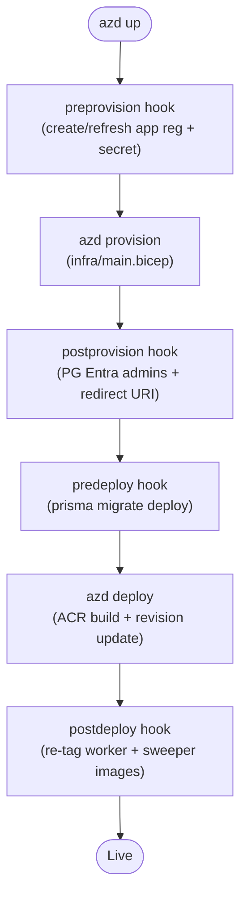

# Deployment

Workshop Buddy deploys to Azure with one command: `azd up`. This doc explains what that command actually does, the lifecycle hooks, and how to recover when things go sideways.

> Companion docs: [azure-architecture.md](azure-architecture.md) · [architecture.md](architecture.md)

---

## Prerequisites

| Tool | Min version | Notes |
| --- | --- | --- |
| [Azure CLI](https://learn.microsoft.com/cli/azure/install-azure-cli) | 2.60 | `az login` against the target tenant before `azd up` |
| [azd](https://learn.microsoft.com/azure/developer/azure-developer-cli/install-azd) | 1.10 | `azd auth login` against the same tenant |
| Docker | 24 | **Required for local build (default).** Optional if you flip to ACR remote build |
| Node.js | 20+ | Only needed if you want to run locally first |

Permissions on the target subscription:

- **Contributor** on the resource group (or higher) — for resource provisioning.
- **User Access Administrator** at subscription/RG scope — to grant the UAMI its RBAC roles and to set the signed-in user as PG Entra admin.
- **Application.ReadWrite.OwnedBy** on Microsoft Graph — for the preprovision hook to create the Easy Auth app reg.

> If you're using PIM-eligible Owner/Contributor at a management group, **activate before** running `azd up`. Long deploys can outlive a 4-hour activation window — see the PIM note in your global Copilot memory.

---

## Local vs remote build

`azd deploy` can build the image two ways. The default is **local Docker build** — it's faster on repeat deploys (BuildKit cache) and avoids the Windows-only `az acr build` Unicode crash from streaming Next.js's box-drawing characters through cp1252.

| Mode | When to use | How |
| --- | --- | --- |
| **Local Docker** (default) | Dev workstations with Docker Desktop running | `azd deploy` **or** `pwsh scripts/deploy.ps1` |
| **ACR remote build** | CI runners, machines without Docker, low-bandwidth links where uploading a built image is slower than uploading source | `pwsh scripts/deploy.ps1 -Remote` (toggles `azure.yaml`, runs `azd deploy`, restores) |

The canonical value in [azure.yaml](../azure.yaml) is `remoteBuild: false`. The `scripts/deploy.ps1 -Remote` flag flips it in place for the deploy and restores it afterward, so the repo state stays clean. azd 1.24.x does not interpolate env vars into the `remoteBuild` field, so a wrapper is required. Switching modes does not require a re-provision — only the build step changes.

> Why not always remote build? The shared ACR build agent on Windows-originated `azd deploy` runs `az acr build` under the hood, which streams colorama-coloured Next.js output through the Windows cp1252 console and crashes on `▲` / `✔` glyphs. We pass `--no-logs` in CI to dodge this; local Docker side-steps it entirely.

---

## One-shot deploy

```bash
azd up
```

azd will prompt for:

| Prompt | What to pick |
| --- | --- |
| Environment name | Short, alphanumeric; becomes part of every resource name (e.g. `demo`, `prod`) |
| Subscription | Your target Azure subscription |
| Location | Any region with AI Foundry availability (e.g. `eastus`, `swedencentral`) |

That's it. `azd up` runs `provision` then `deploy`. Both phases call the lifecycle hooks below.

---

## Lifecycle phases



### preprovision

[azure.yaml](../azure.yaml) → `hooks.preprovision`. POSIX + pwsh variants. Responsibilities:

1. Resolve signed-in principal UPN.
2. Idempotently create the Entra app registration `wb-${envName}-easyauth` with `sign-in-audience AzureADMyOrg`.
3. Issue a 2-year client secret and export `AAD_APP_CLIENT_ID` + `AAD_APP_CLIENT_SECRET` to azd env vars so Bicep can wire them as ACA secrets.

This runs **before** `azd provision` because Easy Auth on the Container App needs the app reg + secret to exist before the auth config child resource can be created.

### postprovision

After Bicep finishes:

1. `az postgres flexible-server microsoft-entra-admin create` for both the UAMI (so compute can connect) and the signed-in deployer (so `prisma migrate deploy` works in predeploy and you can poke at the DB).
2. PATCH the app reg with the resolved web `RedirectURI`: `https://${appFqdn}/.auth/login/aad/callback`.

> The subcommand is `microsoft-entra-admin create` (NOT the deprecated `ad-admin`). See your global azure-cli memory.

### predeploy

1. Build a fresh `DATABASE_URL` using `oss-rdbms` token-based auth.
2. Run `npx prisma migrate deploy` against the new PG.

This is why container startup ([start.js](../start.js)) does **not** run schema mutation — migrations are versioned and applied here before the new image rolls out. Backlog item P0-3.

### postdeploy

`azd deploy` only updates the **web** container app's image. The worker and sweeper jobs are separate ACA resources, so the postdeploy hook re-tags them to the just-deployed image revision by setting `AZURE_WORKER_JOB_NAME` / `AZURE_SWEEPER_JOB_NAME` env vars and issuing `az containerapp job update --image ...` for each.

---

## What gets created

See [azure-architecture.md](azure-architecture.md) for the full resource list and topology.

Outputs from [infra/main.bicep](../infra/main.bicep) that get written into `.azure/<env>/.env`:

- `AZURE_LOCATION`, `AZURE_RESOURCE_GROUP`
- `WEB_APP_FQDN`
- `PG_SERVER_FQDN`, `PG_DATABASE_NAME`
- `FOUNDRY_RESPONSES_ENDPOINT`, `FOUNDRY_MODEL`
- `UAMI_CLIENT_ID`
- `AZURE_WORKER_JOB_NAME`, `AZURE_SWEEPER_JOB_NAME`
- `SERVICEBUS_NAMESPACE`, `SERVICEBUS_QUEUE`

---

## Updating a deployed environment

```bash
# Code-only change (no infra diff)
azd deploy

# Infra change (Bicep diff)
azd provision
azd deploy

# Inspect what would change without applying
azd provision --preview
```

`azd deploy` will re-run the `predeploy` hook (so any new Prisma migration is applied first) and the `postdeploy` hook (so worker + sweeper jobs pick up the new image).

---

## Rollback

There's no "previous revision" magic — but the moving parts are straightforward:

| Resource | Rollback mechanism |
| --- | --- |
| Web Container App | `az containerapp revision activate --revision <prev>` — ACA keeps revisions by default |
| Worker / Sweeper Jobs | `az containerapp job update --image <prev tag>` |
| Postgres schema | Forward-only — write a new migration that reverses. PG PITR (point-in-time restore) is available on Flexible Server for catastrophic cases |
| Service Bus messages | DLQ inspection via Portal → Service Bus → Queue → Dead-letter |
| Whole env | `azd down --purge` then redeploy from a known-good commit |

PG **point-in-time restore** is the nuclear option for data corruption: it creates a new server at a chosen timestamp; you then swap `DATABASE_URL` (in azd env vars and re-deploy) to point at the restored server. Burstable B1ms supports PITR within the retention window (default 7 days).

---

## Common deploy errors

| Symptom | Cause | Fix |
| --- | --- | --- |
| `AuthorizationFailed` on `Microsoft.KeyVault/...` or RBAC writes mid-script | PIM elevation expired | Re-activate PIM, re-run `azd provision` (idempotent) |
| `az acr build` crashes with `UnicodeEncodeError` on Windows | Streaming colored Next.js logs through cp1252 console | Use the default **local Docker build** (see "Local vs remote build" above); or if you must use ACR build, pass `--no-logs` and verify with `az acr task list-runs -r <acr> --top 3 -o table` |
| `archive/tar: write too long` during ACR remote build | A file inside the build context grew while tar was packing (e.g. log file being tee'd into the workspace) | Use local Docker build; or write logs to `$env:TEMP` instead of inside the workspace. `.dockerignore` excludes `scripts/utils/_temp_*` to belt-and-braces this |
| `prisma migrate deploy` fails in predeploy with auth error | Signed-in user isn't PG Entra admin yet (first-deploy race), or token TTL exceeded | Re-run; postprovision hook now sets admin. Confirm via `az postgres flexible-server microsoft-entra-admin list -g <rg> -s <pg>` |
| `Easy Auth: AADSTS50011 redirect URI mismatch` | App reg redirect URI not patched yet, or env name changed | Re-run postprovision hook, or PATCH manually: `az ad app update --id $AAD_APP_CLIENT_ID --web-redirect-uris https://$WEB_APP_FQDN/.auth/login/aad/callback` |
| Worker job never picks up messages | UAMI missing `Azure Service Bus Data Owner`, or `AZURE_CLIENT_ID` not set on the job | Check role assignment on the namespace, and `az containerapp job show ... env`. Bicep wires both — likely a stale env from a pre-refactor deploy |
| New revision Unhealthy, logs show `credentials for '(not available)' are not valid` | Code path constructing `PrismaClient` without the `PrismaPg` driver adapter — the async Entra token function never runs | Mirror the pattern in [start.js](../start.js) / [prisma/seed.js](../prisma/seed.js) — build a `Pool` with `password: async () => credential.getToken(...)`, wrap with `new PrismaPg(pool)`, pass `{ adapter }` to `PrismaClient` |
| `npm run dev` works, ACA returns 500 on `/projects` | DB env var built locally with password, not Entra token | Make sure `.env` on local sets `DEV_AUTH_BYPASS_OID`; in ACA the `DATABASE_URL` is password-less and `db.ts` injects tokens |

---

## Tearing down

```bash
azd down --purge --force
```

`--purge` deletes the soft-deleted Foundry account and Key Vault traces so a re-deploy with the same env name doesn't collide. **This is irreversible** — confirm the env name before running.

---

## See also

- [azure-architecture.md](azure-architecture.md) — what `azd up` actually creates
- [architecture.md](architecture.md) — what runs inside the containers
- [upgrade-plan.md](upgrade-plan.md) — sequenced plan to roll forward to Next 16 / React 19 / Prisma 7
- [azure.yaml](../azure.yaml) — hook source of truth
- [infra/main.bicep](../infra/main.bicep) + [infra/resources.bicep](../infra/resources.bicep) — IaC source of truth
