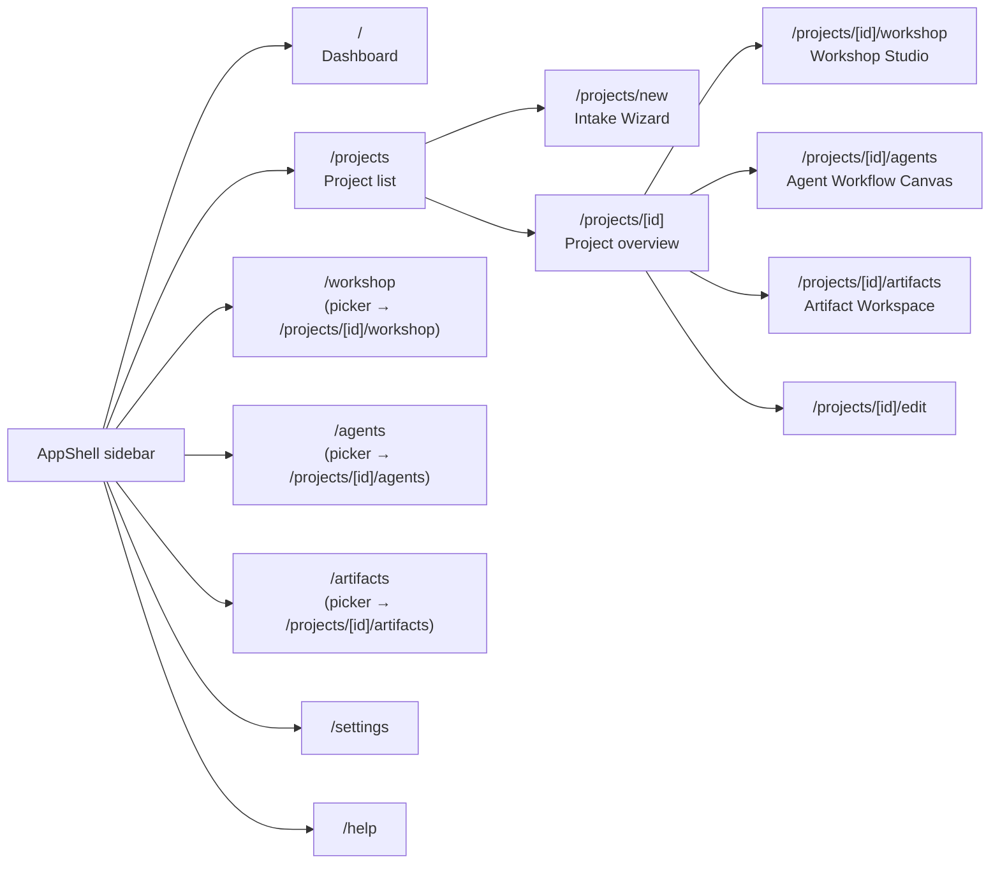
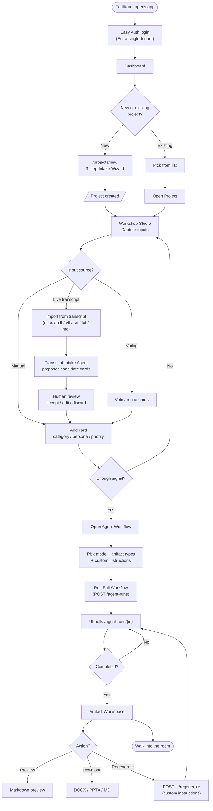
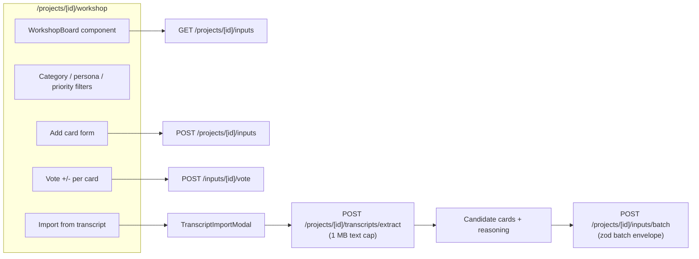
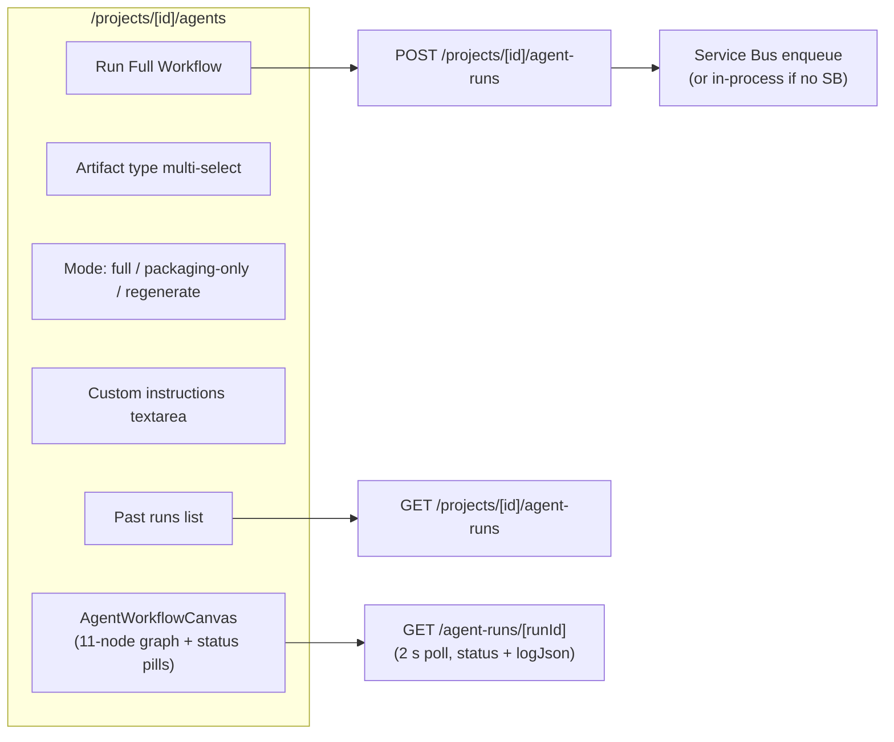
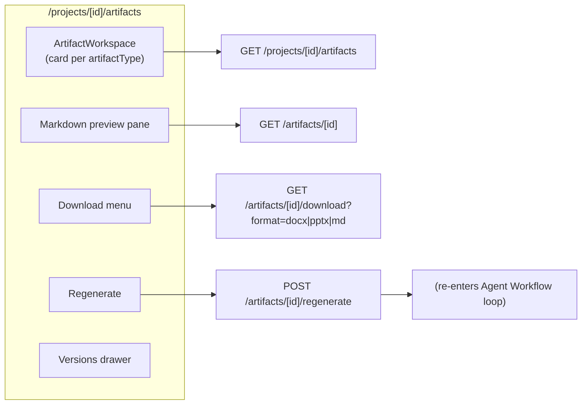
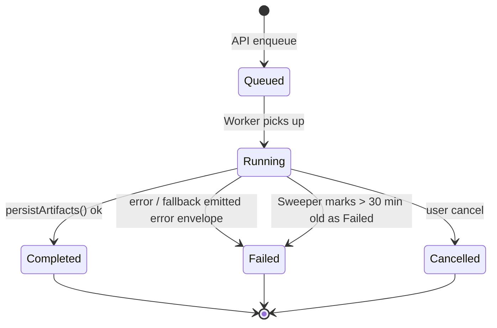

# UI Flows

Workshop Buddy is built around four primary surfaces a facilitator uses live in a workshop: **Workshop Studio**, **Agent Workflow**, **Artifacts**, and the **Project** dashboard.

> Companion docs: [architecture.md](architecture.md) · [agents.md](agents.md) · [transcript-ingest.md](transcript-ingest.md)

---

## Navigation map

The top-level `/workshop`, `/agents`, and `/artifacts` pages are facilitator-friendly entry points — they show a project picker and deep-link into the project-scoped equivalents.

---

## Core facilitator flow (end-to-end)

---

## Workshop Studio (in depth)

---

## Agent Workflow canvas

---

## Artifact Workspace

---

## State + status conventions

`AgentRun.status` transitions surfaced in the UI:

The agent canvas color-codes per-agent status from the `logJson` array inside the run record so a facilitator can see, mid-run, which agent is currently executing.

---

## Accessibility + facilitator-mode niceties

- All primary actions are keyboard-reachable (workshop input form, vote buttons, run workflow).
- Large click targets and high-contrast status pills — workshop rooms are projector-bright.
- Settings page lets the facilitator switch between **demo mode** (mock provider) and **live mode** without redeploying.
- `/help` ([src/app/help/page.tsx](../src/app/help/page.tsx)) carries the facilitator playbook and the recommended workshop run-of-show.

---

## See also

- [architecture.md](architecture.md) — request flow + container boot
- [agents.md](agents.md) — what the workflow actually produces
- [transcript-ingest.md](transcript-ingest.md) — Workshop Studio import detail
