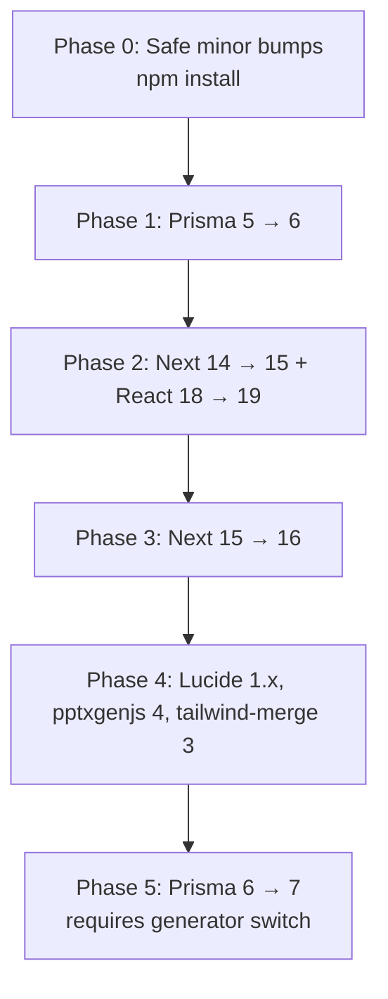

# Dependency Upgrade Plan

> Sources: [Next.js v15 / v16 migration guides](https://nextjs.org/docs/app/guides/upgrading), [Prisma v6 / v7 upgrade guides](https://www.prisma.io/docs/orm/more/upgrade-guides), [React 19 upgrade guide](https://react.dev/blog/2024/12/05/react-19), Context7 (`/vercel/next.js`, `/prisma/web`).

Workshop Buddy is currently pinned to:

| Package | Pinned | Latest | Major delta |
| --- | --- | --- | --- |
| `next` | `14.2.18` | `16.x` | 2 majors |
| `react` / `react-dom` | `18.3.1` | `19.x` | 1 major |
| `@prisma/client` / `prisma` | `5.22.0` | `6.x` (next: `7.x`) | 1-2 majors |
| `@prisma/adapter-pg` | `5.22.0` | `7.x` | 2 majors |
| `lucide-react` | `0.460.0` | `1.x` | named-export breakage |
| `pptxgenjs` | `3.12.0` | `4.x` | API shape change |
| `tailwind-merge` | `2.6.x` | `3.x` | minor breaking |
| `@types/node` | `20.x` | `22.x` (Node 22 LTS) | runtime bump |

All other deps (`@azure/identity`, `@azure/service-bus`, `pg`, `tsx`, `zod`, `docx`, `mammoth`, `clsx`) are at-or-near latest within their semver-allowed range and refresh automatically on `npm install`.

---

## Sequencing — why this order

The hard ordering constraint is **Next 15 → React 19**: Next 15 ships React 19 as the supported peer, and `useFormState`/`useActionState`/`use()` patterns become canonical. Prisma 6 is independent and the smallest blast-radius (it stabilizes driver adapters we already use). Lucide / pptxgenjs / tailwind-merge majors are isolated leaf upgrades.



Each phase = one PR, validated with `npm run typecheck && npm run build && azd deploy` against a non-prod azd env before merging.

---

## Phase 0 — Safe in-range bumps (no code changes)

Already applied by the most recent `npm install` (lockfile updated):

- `@azure/identity` 4.5 → 4.13
- `pg` 8.13 → 8.21
- `tailwind-merge` 2.5 → 2.6
- `docx` 9.0 → 9.7

No work — just commit the new `package-lock.json`.

---

## Phase 1 — Prisma 5 → 6 ✅ shipped 2026-05-28

**Why first:** smallest surface area, stabilizes the driver-adapter pattern we already use end-to-end (`src/lib/db.ts`, `prisma/seed.js`, `start.js`).

> **Outcome:** prisma 6.19.3 live on revision `azd-1780004461`, `/api/health` 200.
>
> **Gotchas hit:**
> - `PrismaPg` v6 constructor takes a pg config object directly (no separate `Pool`); `password` accepts an async function called per new connection — clean fit for Entra token rotation, removed our `setInterval` pool-churn hack.
> - `driverAdapters` graduated to stable — removed from `previewFeatures`.
> - The default base image (`mcr.microsoft.com/azurelinux/base/nodejs:20`) segfaults loading Prisma 6's engine (both N-API and standalone binary). Swapped to `node:20-bookworm-slim` — Prisma's primary tested target.
> - **`engineType = "binary"` is incompatible with driver adapters** — throws `PrismaClientConstructorValidationError` at runtime. Use the default library engine.
> - Added `--ignore-scripts` to `npm ci` so Prisma's postinstall doesn't run inside the deps layer (we run `prisma generate` explicitly in the builder stage).

```bash
npm i -D prisma@^6
npm i  @prisma/client@^6 @prisma/adapter-pg@^6
npx prisma generate
```

### Breaking changes that affect us

| Change | Impact | Fix |
| --- | --- | --- |
| `Bytes` field type returns `Uint8Array` instead of `Node Buffer` | Low — we don't use `Bytes` in the schema | None |
| Full-text-search `Postgres` preview now stable | Low — we use simple `WHERE LIKE` | None |
| Minimum Node 18.18 | None — image is on Node 20 | None |
| `engineType=binary` still supported | None — we run on the default library engine via the adapter | None |

### Validation

```bash
npm run typecheck
npm run build
npm run db:seed  # local
azd deploy       # against dev env
```

If `/api/health` returns 200 and a manual project create + agent run succeed, ship.

---

## Phase 2 — Next 14.2 → 15 + React 18 → 19

**Why together:** Next 15 ships with React 19 as its supported peer; mixing Next 15 + React 18 is unsupported.

```bash
npx @next/codemod@canary upgrade latest      # interactive, picks 15.x
npx @next/codemod@latest next-async-request-api .
npm i react@^19 react-dom@^19
npm i -D @types/react@^19 @types/react-dom@^19
```

### Breaking changes that affect us

1. **Async Request APIs** — `cookies()`, `headers()`, `draftMode()`, route `params`, page `searchParams` are now `Promise`-returning. The `next-async-request-api` codemod rewrites call sites:

   ```ts
   // Before
   export default function Page({ params }: { params: { id: string } }) {
     const cookieStore = cookies()
     const token = cookieStore.get('token')
   }

   // After
   export default async function Page({ params }: { params: Promise<{ id: string }> }) {
     const { id } = await params
     const cookieStore = await cookies()
     const token = cookieStore.get('token')
   }
   ```

   Audit targets in this repo: every dynamic route under [src/app/](../src/app/) using `[projectId]` / `[artifactId]` / `[inputId]`, and any server component reading cookies.

2. **`fetch` no longer caches by default** — opt in with `fetch(url, { cache: 'force-cache' })` if you were relying on the implicit cache. We don't, but verify when AI provider calls land.

3. **`unstable_after` → `after`** stable in 15.1 — currently unused.

4. **React 19**: removed `propTypes`, `defaultProps` on function components, legacy context. We don't use any of these.

5. **`useFormState` → `useActionState`** import path changes; rename done by codemod.

### Risks

- The webpack `concatenateModules: false` workaround in [next.config.js](../next.config.js) was for a Next 14.2 + Node 23 scope-hoist bug. Drop the workaround in this phase and re-run a full build; if the bundle bug is gone, leave it dropped (smaller chunks).
- `serverComponentsExternalPackages` moved to top-level `serverExternalPackages` in Next 15.

### Validation

Beyond typecheck + build + deploy: walk the full UI flow (project create → agent run → artifact download). The async-params codemod is mechanical but page-by-page review of [src/app/projects/[projectId]/](../src/app/projects/[projectId]/) is worth the 20 minutes.

---

## Phase 3 — Next 15 → 16

**Why separate:** lets us land 15 cleanly, then take 16's stricter enforcement (sync request-API access is fully removed in 16) without conflating root causes.

```bash
npx @next/codemod@canary upgrade latest
```

### Breaking changes that affect us

| Change | Impact | Fix |
| --- | --- | --- |
| Sync access to `cookies()`/`headers()`/`params` fully removed | Already addressed in Phase 2 | None |
| `next lint` removed, ESLint flat config required | Low — we run `eslint` directly | Migrate `.eslintrc.json` → `eslint.config.mjs` |
| `experimental.serverComponentsExternalPackages` definitively removed | Already migrated in Phase 2 | None |

---

## Phase 4 — Isolated leaf majors

- **`lucide-react` 0.x → 1.x**: most icon imports stay the same, but a few were renamed (e.g. `LayoutGrid` casing). Grep [src/components/](../src/components/) and fix one-by-one.
- **`pptxgenjs` 3 → 4**: see [docs/agents.md](agents.md) — used only in [src/lib/artifacts/pptx-renderer.ts](../src/lib/artifacts/pptx-renderer.ts). v4 renames `addSlide({masterName})` → `addSlide({sectionTitle})`. Single file change.
- **`tailwind-merge` 2 → 3**: API surface unchanged for our usage (`cn()` helper in [src/lib/utils.ts](../src/lib/utils.ts)).
- **Node 22 LTS** in the Dockerfile: bump `BASE_IMAGE` to `mcr.microsoft.com/azurelinux/base/nodejs:22` and bump `@types/node` to `^22`. Required before Node 20 EOL (April 2026).

---

## Phase 5 — Prisma 6 → 7 (largest delta, defer until needed)

**Why last:** Prisma 7 ships the Rust-free `prisma-client` generator. The generated client moves out of `node_modules/@prisma/client` to a path you choose, and `@prisma/client` becomes a thin re-export shim. The driver adapter requirement is now mandatory (we already comply).

```bash
npm i -D prisma@^7
npm i  @prisma/client@^7 @prisma/adapter-pg@^7
```

### Schema change

```prisma
// Before (v6)
generator client {
  provider = "prisma-client-js"
}

// After (v7)
generator client {
  provider = "prisma-client"
  output   = "../src/generated/prisma"
}
```

### Code change

```ts
// Before
import { PrismaClient } from "@prisma/client"

// After
import { PrismaClient } from "@/generated/prisma/client"
```

Touchpoints: [src/lib/db.ts](../src/lib/db.ts), [prisma/seed.js](../prisma/seed.js), [start.js](../start.js), [worker/agent-run-worker.ts](../worker/agent-run-worker.ts).

The driver-adapter pattern is unchanged — just the import path.

---

## CI gate (future)

When CI lands ([BACKLOG.md](../BACKLOG.md) P2-x), each phase PR runs:

```yaml
- npm ci
- npm run typecheck
- npm run lint
- npm run build
- azd deploy --no-prompt   # against ephemeral env
- curl -fsS $SERVICE_WEB_URI/api/health
```

Until then, validation is local + manual `azd deploy` against the `wb` env.
